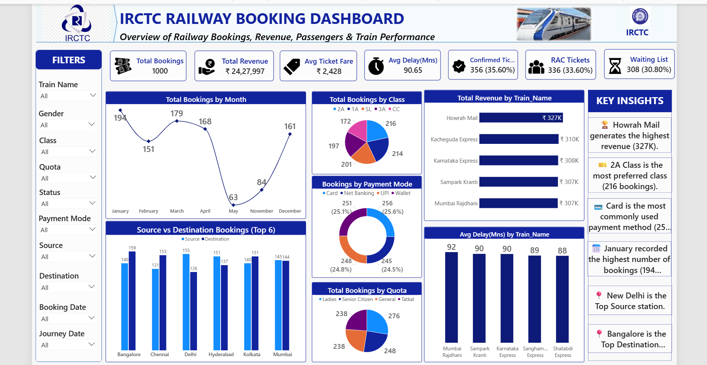

# 🚂 IRCTC Railway Booking Dashboard — Power BI

An interactive Power BI dashboard analyzing 1000+ railway bookings across trains, routes, and passenger behavior. Features 7 KPI cards, 8 dynamic visuals, 10 interactive filters, and a Key Insights panel — built using DAX measures, Power Query, and advanced conditional formatting.


## 🖼️ Dashboard Preview



---

## 📌 Overview

This dashboard provides a comprehensive view of **1000 railway bookings**, enabling quick insights into revenue, ticket status, delay analysis, and passenger behavior across various trains, classes, and routes.

---

## ✨ Features

### 🔢 Key Performance Indicators (KPIs)
| KPI | Value |
|-----|-------|
| Total Bookings | 1,000 |
| Total Revenue | ₹ 24,27,997 |
| Avg Ticket Fare | ₹ 2,428 |
| Avg Delay (Mins) | 90.65 |
| Confirmed Tickets | 356 (35.60%) |
| RAC Tickets | 336 (33.60%) |
| Waiting List | 308 (30.80%) |

---

## 📊 Visuals Used

| Chart | Type | Insight |
|-------|------|---------|
| Total Bookings by Month | Line Chart | January highest (194 bookings) |
| Source vs Destination (Top 6) | Clustered Bar | Bangalore & Mumbai top routes |
| Total Bookings by Class | Pie Chart | 2A most preferred (216 bookings) |
| Bookings by Payment Mode | Donut Chart | UPI leads (256 — 25.6%) |
| Total Bookings by Quota | Pie Chart | General quota dominates (276) |
| Total Revenue by Train Name | Bar Chart | Howrah Mail highest (₹327K) |
| Avg Delay by Train Name | Column Chart | Mumbai Rajdhani most delayed (92 mins) |
| Key Insights Panel | Text Cards | 6 auto insights on right side |

---

## 💡 Key Insights

- 🏆 **Howrah Mail** generates the highest revenue (₹327K)
- 💺 **2A Class** is the most preferred travel class (216 bookings)
- 💳 **Card** is the most commonly used payment method (25.6%)
- 📅 **January** recorded the highest number of bookings (194)
- 📍 **New Delhi** is the Top Source station
- 📍 **Bangalore** is the Top Destination station
- ⏱️ **Average train delay** across all trains is 90.65 minutes

---

## 🔍 Interactive Filters

| Filter | Field |
|--------|-------|
| Train Name | Filter by specific train |
| Gender | Male / Female |
| Class | 2A, 1A, SL, 3A, CC |
| Quota | General, Ladies, Senior Citizen, Tatkal |
| Status | Confirmed, RAC, Waiting |
| Payment Mode | Card, UPI, Net Banking, Wallet |
| Source | Departure station |
| Destination | Arrival station |
| Booking Date | Date range slicer |
| Journey Date | Date range slicer |

---

## 🛠️ Tools & Techniques Used

| Tool / Feature | Purpose |
|----------------|---------|
| Microsoft Power BI | Primary tool |
| Power Query | Data cleaning & transformation |
| DAX Measures | KPI calculations |
| Conditional Formatting | Color-coded KPI cards |
| Slicers | Interactive filtering |
| Bookings-SD Table | Unpivoted Source & Destination data |
| Custom Measures | Confirmed/RAC/Waiting % display |

---

## 🧮 DAX Measures Used

```DAX
-- Confirmed Tickets with Percentage
Confirmed Display =
FORMAT(CALCULATE(COUNTA(Table1[Status]), Table1[Status] = "Confirmed"), "#,##0")
& " (" & FORMAT(DIVIDE(CALCULATE(COUNTA(Table1[Status]),
Table1[Status] = "Confirmed"), COUNTA(Table1[Status])) * 100, "0.00") & "%)"

-- RAC Tickets with Percentage
RAC Display =
FORMAT(CALCULATE(COUNTA(Table1[Status]), Table1[Status] = "RAC"), "#,##0")
& " (" & FORMAT(DIVIDE(CALCULATE(COUNTA(Table1[Status]),
Table1[Status] = "RAC"), COUNTA(Table1[Status])) * 100, "0.00") & "%)"

-- Waiting Tickets with Percentage
Waiting Display =
FORMAT(CALCULATE(COUNTA(Table1[Status]), Table1[Status] = "Waiting"), "#,##0")
& " (" & FORMAT(DIVIDE(CALCULATE(COUNTA(Table1[Status]),
Table1[Status] = "Waiting"), COUNTA(Table1[Status])) * 100, "0.00") & "%)"
```

---

## 📁 File Structure

```
📦 IRCTC-Railway-Booking-Dashboard
 ┣ 📊 IRCTC_Dashboard.pbix         # Power BI file
 ┣ 📂 Dataset
 ┃ ┗ 📄 irctc_sample_dataset.xlsx  # Raw dataset
 ┣ 📸 IRCTC_Dashboard.png          # Dashboard screenshot
 ┗ 📄 README.md                    # Project documentation
```

---

## 📂 Dataset Columns

| Column | Description |
|--------|-------------|
| Booking_ID | Unique booking identifier |
| Passenger_Name | Name of passenger |
| Age | Passenger age |
| Gender | Male / Female |
| Train_No | Train number |
| Train_Name | Train name |
| Source | Departure station |
| Destination | Arrival station |
| Class | Travel class (2A, 1A, SL, 3A, CC) |
| Quota | Booking quota type |
| Booking_Date | Date of booking |
| Journey_Date | Date of journey |
| Ticket_Fare | Fare amount in ₹ |
| Seat_No | Allocated seat number |
| Status | Confirmed / RAC / Waiting |
| Payment_Mode | Card / UPI / Net Banking / Wallet |
| Delay_Minutes | Delay in minutes |

---

## 🚀 How to Use

1. Download the `IRCTC_Dashboard.pbix` file
2. Open in **Microsoft Power BI Desktop**
3. Use **slicers on the left** to filter data
4. Hover over charts for **detailed tooltips**
5. Click any chart element to **cross-filter** other visuals

---

## 🙋 About Me

**A Vinitha Sree** - Aspiring Data Analyst
- 💼 [LinkedIn Profile](https://www.linkedin.com/in/yourprofile)
- 📧 vinithasree04@gmail.com

---

## 📃 License

This project is for educational and portfolio purposes.
Feel free to use and adapt with attribution.

⭐ **Star this repo if you found it useful!**
